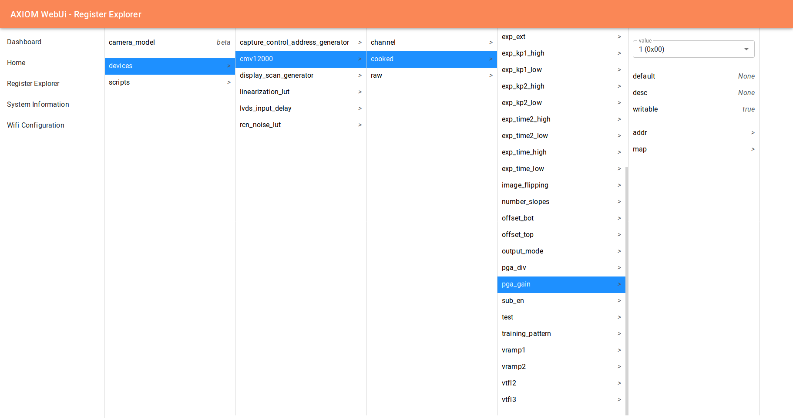

# AXIOM webui
A web based user interface to control AXIOM cameras.
To be used in connection with [ctrl](https://github.com/axiom-micro/ctrl), the central hardware 
abstraction layer for AXIOM cameras.

## Features
The webui already has some working features, many WIP features and some planed features:

### Register Explorer
The Register Explorer is a direct mapping of the api provided by [ctrl](https://github.com/axiom-micro/ctrl).
It is quite useful to experiment with registers of all the camera parts (eg. the image sensor) during development
or for fun :)

It features a "Finder" like ui and displays values & information inline.



### Dashboard
The Dashboard is not implemented yet but shold be the place where values are presented in a more "end user friendly" way.
The user should be able to configure which values (found out via the register explorer) should be mapped to which widgets.
There should be more & better widgets for data display. Eg. Sliders, Toggle Switches, ... should be implemented.

### System Information
Displays some metrics and a bunch of useful information about the state of the camera.

### Wifi Configuration
This Feature is not done yet but should be used to configure the camera hotspot or change the camera to be a 
Wifi client.

## Architecture
Most of the code of the webui is in the frontend. The fronted is written using react & uses many modern
js/ts features. The bundler used is parcel.

The backend is written in nodejs and is only there to execute shell commands, the frontend sends over a 
`socketio` connection. Ie. the Register explorer issues a lot of `find` `cat` and `echo` commands and parses
the results, but the backend has no knowledge of any control daemon. This allows us to have absolutely no
business logic in the backend.

## Develop!
To start developing the webui clone this repository and install the dependencies:
```bash
git clone https://github.com/axiom-micro/webui
cd webui
yarn install
```

Now you need to start *ctrl* and adjust the symlink `ctrl_mountpoint` to point to the mountpoint of ctrl. 
A development server that listens on port 3000 can be started with:
```
yarn watch
```

Then open a browser and see the webui :). 
If you open a pr, please format your code with `yarn format` before.